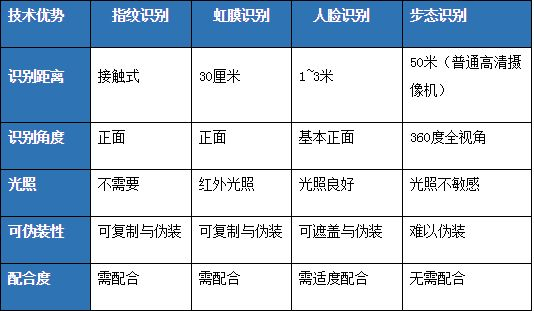

# 步态识别 Gait Recognition 的原理和技术


## 疑问

天网给每人都存档步态特征, 类似给每人都存档面部特征, 是可能的吗? (够呛)

步态特征有效期多久? 三个月之后的步态跟以前一样吗? (几年内, 据称)

多少程度依赖领域相关的特征提取? 核心特征是什么? 有没有类似 `106人脸关键点` 的行业标准? (常用 GEI)

对抗模型研究的如何? (TODO: 没看到)

银河水滴的 CASIA-B 训练集只有124人, 靠谱么? (存疑)


## 步态识别基本介绍

> 步态识别，也不光是中国用，其他情报部门都在用。

步态识别可行性来源于人类行走姿态的不同，英国南安普敦大学电子与计算机系的马克·尼克松教授的研究显示，人人都有截然不同的走路姿势，因为人们在肌肉的力量、肌腱和骨骼长度、骨骼密度、视觉的灵敏程度、协调能力、经历、体重、重心、肌肉或骨骼受损的程度、生理条件以及个人走路的“风格”上都存在细微差异，在公共安全领域，步态识别技术比一般图像识别更具优势

**主要优势**

- 识别距离远 - 非接触远距离跨场景特征采集
- 应用范围广
- 无需对象配合
- 难以伪装 - 具有广义的唯一性以及难以伪装性，它是对动作进行检测，动作序列在算法上可以进行插值而不至于完全失真
- 极端场景表现好 - 它在恶劣天气造成低像素的情况下, 比人脸识别表现更好


## 银河水滴

创始人兼CEO黄永祯

> 全球唯一步态识别商业化企业，拥有全球最高精度的步态识别技术，可实现普通高清摄像机 (2K摄像机) 下最远50米的远距离、跨视角识别，不依赖于人脸信息，对光照不敏感，无需识别目标主动配合。



技术: 步态识别、人脸识别、ReID（行人再识别/跨镜追踪）

产品: 步态检索智能一体机“水滴神鉴”，步态识别、检索与追踪系统，步态智能盒子、步态人脸抓拍机，WATRIXBOX，步态智能机芯

应用: 

- 石油企业引入步态识别技术完善防控网络，防范非法闯入者 (工作人员步态设为白名单)
- 家居领域，应用于家电，实现智能化感知，提供个性化服务
- 公共安全领域，进行人员管理，保障公共安全

另有工业检测技术, 工业视觉平台“IndustryAI”, 工业视觉应用的四大类别问题——定位引导、尺寸测量、异常检测和识别分类


[步态识别答疑 – 银河水滴科技](http://www.watrix.ai/dayijiehuo/)

Q: 相比人脸，步态识别对实地场景的环境要求更高，如人流过大会遭遇遮挡覆盖等影响判断，这种情形怎么办？
A: 所有识别方式都会受遮挡的干扰。步态相对而言拥有独特的优势，一是识别距离比较远，有更长时间来进行调整和对新变化实时响应 (比如遮挡去除)，另外识别的是全身信息，可以实现360°全视角识别，更加灵活高效

Q: 基于超高清摄像头识别距离可达50米，但是目前公安只有部分超高清，是否会限制应用？
A: 50米识别是普通高清摄像头 (目前公安主流)，超高清可以更远

Q: 步态识别都识别哪些关键点？
A: 动态特征：迈步的幅度、步子的频率、身体重心、两腿的协调关系也就是步姿、手臂的摆幅等
静态特征：体型（高矮、胖瘦）、头型、肩宽等
步态特征的提取过程：由摄像机采集人的步态视频，通过检测、分割和跟踪获得步态序列，经过特征表达提取该人的步态特征。过程中不会对人身细节做精细处理，只需要人的一个剪影即可，充分体现安全性


"只需要人的一个剪影即可", 可能是提取的 GEI 特征


Q: 人长高了还能识别么？
A: 如果几年之内的成长变化，特征点变化幅度不大依旧可以进行有效识别，如果十几年时间，特征点已经发生非常明显改变，没办法有效识别

Q: 和姿态识别有什么区别？
A: 姿态识别可以实现人体动作、手指运动等姿态的估计，对于描述人体姿态、预测人体行为至关重要。基于对人体关键节点的观察，比如骨骼、关节等
姿态识别应用于跌倒检测、虚拟试衣、体感游戏等场景


## 学界常用数据库

> **银河水滴**拥有著名的CASIA-B大型步态数据库，一直是国际上最流行的数据库之一

**CASIA Database(B)** 是一个大规模的，多视角的步态库，采集于2005年1月。共有124个人，每个人有11个视角（0, 18, 36, ... 180度），在三种行走条件下 普通条件/穿大衣/携带包裹 采集
特点: 视角最多，包含不同的行走状态（穿衣与带包） [步态识别问题简介](https://zhuanlan.zhihu.com/p/29150645)


**OU-ISIR** 共有4007个不同的行人。每人2个视频，一个作gallery，一个作prob。总共有四个视角 55°, 65°, 75°, 85°，可能不同人的视角不同
特点: 行人身份种类多，但每个人的视角、行走状态差别较小

**USF** 共有122个人。五个不同因素：2种鞋子种类、2种拿东西的状态、2种地面种类、2种视角、2种录制时间。这五种因素相互排列组合，组成32个视频
特点: 室外复杂场景录制，因此GEI更嘈杂


## 步态识别的基本流程


广义的步态识别流程分为4个主要阶段:
```
行人检测 -> 行人分割 -> 行人追踪 -> 行人识别
```


任务流程图


来自 [深度学习在步态识别中的应用](https://zhuanlan.zhihu.com/p/52883475)


任务目标: 

**验证任务 (Verification)** : 给定注册样本 (Probe Sample) 和验证样本 (Gallery Sample)  依据相似度指标或给定的阈值判断它们是否具相同身份 (即, 俩是否为同一人)

**辨别任务 (Identification)** : 给定注册样本和验证集 (Gallery Set) 中 N 个样本, 找出验证集和注册样本具有相同身份的验证样本 (即, 从一堆人里找到一个人)


## 涉及的通用技术


**人形跟踪技术**
人形跟踪技术使用深度卷积神经网络提取行人的表观特征，并结合行人运动轨迹的动态特征，共同得到人的运动轨迹和位置，并支持实时的多人同时跟踪，其算法实际在 GPU 上运行可达到毫秒级别

这个技术的应用举例 `检测顾客进店 -> 识别顾客身份 -> 获取顾客属性 -> 形成顾客轨迹 -> 分析顾客行为`  [跨摄像头人形轨迹追踪技术在新零售应用 旷视张弛](https://myslide.cn/slides/9751) 或 [ITSlide](https://www.itslide.com/slide/253046) 按照他的 PPT, 识别顾客身份用 `Face Recognition`, 获取顾客轨迹用 `Person Re-ID`, 分析顾客行为用 `Pose Estimation`, 这几个技术在步态识别时可能也有用

行人重识别 Person Re-identification 简称 ReID, 判断图像或者视频序列中是否存在特定行人的技术, 被认为是图像检索的子问题, 给定一个监控行人图像, 检索跨设备下的该行人图像 [论文笔记-Person Re-id Past, Present and Future](https://blog.csdn.net/zdh2010xyz/article/details/53741682) [基于深度学习的行人重识别研究综述](https://www.kesci.com/home/project/5db2b91e080dc300371bea6f)


**人形检测技术**
人形检测使用深度卷积神经网络作为基础结构，通过在不同抽象级别的网络层中施加学习目标从而实现了多尺度的人体检测。可在复杂环境下进行鲁棒的行人检测，例如背景杂乱，人体姿态变化大，光线变化大以及人群相对聚集的情况。算法可以对主流分辨率下视频流进行实时检测

即目标检测, 用 R-CNN 系列算法 `Fast R-CNN`, `Faster R-CNN`, `YOLO`


**人形分割技术**
人形分割使用深度卷积神经网络作为基础结构，结合了反卷积网络对分割目标进行逐像素分类。接受人体检测出的区域作为输入，能够在相对较复杂的情况下进行人体分割。人体分割的精度接近人眼水准，分割成像速度可达到毫秒级别

即前背景分离技术, 可以用 Mask R-CNN (掩码区域卷积神经网络)

`R-CNN` 是标出物体的矩形框 [目标检测笔记一：算法入门与优缺对比](https://zhuanlan.zhihu.com/p/29016445)

`Mask R-CNN` 是标出物体的准确像素 [Mask R-CNN 论文详解](https://zhuanlan.zhihu.com/p/57759536)

> 模型的所有实例都胜过了先前最先进的模型, 在MS COCO测试集上的结果基于ResNet-101，掩码AP（平均超过IoU阈值）达到了35.7，并可以5FPS的速度运行, Nvidia Tesla M40 GPU, 测试时间是195ms/张


## 步态能量图 GEI

步态能量图 (Gait Energy Image, GEI) 是步态识别任务的特征提取成果, 其提取方法是：
1. 视频检测行人位置，使用分割/Matting/背景建模等方式得到行人的掩膜 (mask) 或行人轮廓 (silhouette)
2. 将含有行人的部分图片切割出来，使用几何重心对各帧掩膜进行对齐
3. 将各个帧的掩膜进行平均得到GEI

 

该方法较为简单，但是相比其他特征更加稳定和有效 [步态识别问题简介](https://zhuanlan.zhihu.com/p/29150645)  [GEI步态能量图生成](https://blog.csdn.net/weixin_30763397/article/details/96722139)

**在 GEI 基础上的更优的特征表达**

对 GEI 的动态部分单独提取出来DGEI (Dynamic Gait Energy Image)，然后使用主成分分析降维再使用局部投影 Zhang et al. (2009) 

以及其他大量优化 GEI 的改进


## 用于判别的模型实现细节

目的: "判断俩是否为同一人"以及"从一堆人里找人", 都算是这种模型

> 现有的算法中，判别式算法一般准确率（90%）均大于生成式算法（60%）


用什么损失函数? 

有两大类, 第一类, **学习特征表示**: 我理解是 `低维的步态特征=f(模型输入)` 目标是训练这个 f, 之后使用 kNN 在验证集中找到最近的样本

第二类, **学习样本间的相似度函数**: 将步态识别问题看成二分类问题，即判断一个二元组步态序列是否来自于同一个对象, 我理解是 `相似度=f(输入的步态特征A, 输入的步态特征B)` 目标是训练这个 f

不同于表征学习, 度量学习旨在学习出两张图片的相似度, 易理解的度量学习损失方法有对比损失 (Contrastive loss)、三元组损失 (Triplet loss)、四元组损失 (Quadruplet loss), 最好的是边界挖掘损失 (Margin sample mining loss, MSML), 损失函数在 [基于深度学习的行人重识别研究综述](https://www.kesci.com/home/project/5db2b91e080dc300371bea6f) 里有介绍


怎么做特征提取? 

也是两大类, **基于模型 Model-Based** 和 **基于非模型 Model-Free**

**基于模型** 就是把视频里的东西按照"人"建模, 有脑袋胳膊腿, 人体各部位使用直线、骨架、椭圆等等来表示, 感觉这种比较古老

**基于非模型** 就是把视频图像直接抽取特征, 不经过"人"的概念, 比如 GEI 就是基于非模型, 光流分布也是非模型, 在 GEI 基础上还有一堆衍生 [步态识别综述论文笔记](https://zhuanlan.zhihu.com/p/94580835)


模型具体怎么实现? 有人举例了下面六种方法

1) 基于预训练模型
利用预训练模型 VRR-16 得到基于步态轮廓图的深度卷积特征表示 (Zhang, Sun, Li, Zhao, & Hu, 2017) 在无视角变化的情况下对步态图像具有一定的泛化能力，但在跨视角场景及协变量变化时无法有效提取具有判别力的特征

2) 基于步态能量图网络 
用步态能量图作为模型输入 (Shiraga, Makihara, Muramatsu, Echigo, & Yagi, 2016)

3) 基于 3D 卷积
利用 3D 卷积捕捉步态序列中的时空信息，使用多视角 3D 卷积网络 (Multi-view 3D Convolutional Neural Network MV3DCNN) 获取步态轮廓图的特征信息 (Wolf, Babaee, & Rigoll, 2016)
为了解决卷积网络无法处理不定长步态序列的问题，将一个步态序列切分成若干个固定长度的短序列进行处理

4) 基于度量学习
利用基于输入/输出架构的卷积神经网络 (Input/Output Architectures Convolutional Neural Network, I/O-ACNN) 分析不同的网络结构和损失函数对步态识别准确率的影响 (Takemura, Makihara, Muramatsu, Echigo, & Yagi, 2017)

5) 基于人体姿态关键点
利用开源的姿态估计算法从原始的视频序列中提取人体的姿态信息 (Liao, Cao, Garcia, Yu, & Huang, 2017)，利用 CNN 提取关键点中的空间信息，利用 LSTM 提取时间信息
利用姿态关键点进行步态识别可以有效缓解协变量变化对步态识别性能的影响
缺点之一是未能在跨视角的场景下验证模型的有效性

!!! note

    姿态关键点可能是类似这个 gait recognition and human pose estimation
    https://github.com/marian-margeta/gait-recognition 
    其中 HumanPoseNN 只管识别姿势, 不管步态, 多人重叠时不理想
    其中 GaitNN 据称在包含正常行走、背包行走和穿coating shoes行走的305人测试中达到最高水平


6) 基于相似度学习
通过深度卷积神经网络 (Deep CNNs) 直接学习步态能量图或步态序列之间的相似度 (Wu, Huang, Wang, Wang, & Tan, 2017)


## 用于生成的模型实现细节

目的: 将某种状态下输入的步态特征, 变换到另一种状态下, 再进行匹配或特征抽取

> 现有的算法中，判别式算法一般准确率（90%）均大于生成式算法（60%）

有一集 "机智过人", 提到怎么 "把舞蹈演员的正面步态特征转换成侧面剪影", 用的 GAN [通过步态精确识别四胞胎](http://www.watrix.ai/2018/11/11/jizhiguoren2/)

有三种方法

1) 基于 LSTM 和人体关节热图

利用"基于姿态的长短时记忆模块" (Pose-Based LSTM, PLSTM) 对人体关节热图序列进行端到端的重构 (Feng, Li, & Luo, 2016) 使用 CNN 获得关节点热图，作为 LSTM 的输入
人体关节热图对于衣着变化等协变量的影响小于步态轮廓图，但是在于单个模型只能得到两种视角下视角不变的特征表示，无法对三个及三个以上视角下的步态序列同时进行建模

2) 基于生成对抗网络

基于步态生成对抗网络 (GaitGAN) 的方法能够同时缓解视角、衣着等协变量对识别性能的影响 (Yu, Chen, Reyes, & Poh, 2017) [GaitGAN: Invariant Gait Feature Extraction Using Generative Adversarial Networks](http://openaccess.thecvf.com/content_cvpr_2017_workshops/w6/papers/Yu_GaitGAN_Invariant_Gait_CVPR_2017_paper.pdf)

用的是 PixelDTGAN, 把任意角度采集的摄像转成侧视图, 把不规则的行走序列转成正常行走序列, 不受穿衣, 手持物品的干扰


3) 基于多层自编码

基于多层自编码器 (AutoEncoder) 的统一模型，缓解步态识别中的视角、衣着、携带物等协变量改变对识别性能的影响 (Yu, Chen, Wang, Shen, & Huang, 2017)

[自编码器是什么？有什么用？入门指南（附代码）](https://zhuanlan.zhihu.com/p/34238979) 

编码函数 `h=f(x)` 解码函数 `r=g(h)` 整个自编码器就是函数 `g(f(x)) = r` 优化函数使输出r与原始输入x相近

自编码器本质在于, 限制h维度使其小于输入x, 训练有损表征, 使其能学习到数据中最重要的特征, 用途一是**数据去噪**，用途二是**为进行可视化而降维**, 自编码器可以无监督学习且不需要任何新的特征工程


## GaitSet

复旦提出 GaitSet 算法 (Chao, He, Zhang, & Feng, 2018) 是重大突破, 参考 [【论文阅读】GaitSet](https://zhuanlan.zhihu.com/p/50939982)

Set 指一组轮廓图, 即把一个步行循环的每一帧排列在一起, 合并成一个输入

其核心思想在于：相邻几帧轮廓外观很显然的包含了步态序列的先后信息, 于是, 步态序列的时序是不必要的, 可以将步态轮廓图当作没有时序关系的图像集, 让深度神经网络自身优化去提取并利用这种关系

优势: 不受时序的约束, 保持了步态识别的灵活性, 可以更容易融合不同视频下的帧, 可以配合 Re-ID 技术增加数据


## GaitNet

[GaitNet论文笔记](https://zhuanlan.zhihu.com/p/94581510) 当前主要的步态识别方法采用人形剪影或者链接类型的人体模型作为步态特征, 当面临着装、携带物品或者角度的变化时效果不理想, 因此提出一种自动编码的框架GaitNet, 从视频中分隔出外观特征、典范特征（类似于GEI的静态特征）以及姿态特征（使用LSTM，作为动态特征）

三个核心特征:

- pose feature 外观特征, 描述对象的衣服
- appereance feature 姿势特征, 描述身体部位的位置，其随时间的动态变化是步态的核心要素
- canonical feature 身材特征, 典范特征（矩形，三角形，倒三角形和沙漏形身材）手臂长度、躯干vs腿长的比例等

流程: 输入GaitNet的是一段视频序列，使用目标检测与分割算法 Mask R-CNN 提取人物，设计三种损失函数，编码后的数据用于区分 pose, canonical, appearance


## 困难

**摄像的视角**

> 数据采取的视角是对步态识别影响最大的协变量。


传统的解决方案

- 视角变换模型 (View Transform Model) 对步态模板进行视角变换的工作(Makihara, Sagawa, Mukaigawa, Echigo, & Yagi, 2006)
- 使用典型相关分析学习针对特定视角的投影矩阵。挖掘数据的低维几何结构，学习视角无关的判别投影矩阵 (Hu, Wang, Zhang, Little, & Huang, 2013)
- 通过学习投影的方式将处于不同视角下的步态模板投影到一个视角无关的公共子空间中进行识别 (Kusakunniran, Wu, Zhang, Li, & Wang, 2014)
  

传统研究对于解决不同视角下步态特征之间的高度非线性相关性依然缺乏有效的建模手段。

GaitGAN 应该也算解决方案


**复杂场景**

平地步行是最简单的场景，上下楼和爬坡就要复杂一些

跑步能认出来么?

人的情绪变动也会影响步态

跟不同的鞋有关吗? 行李箱怎么解决? 扛个包不就跟瘸了一样吗? 

人流密集怎么办? GEI 都生成不准, demo 都是每个人依次走过摄像头

怎么结合其他特征来提高准确性


